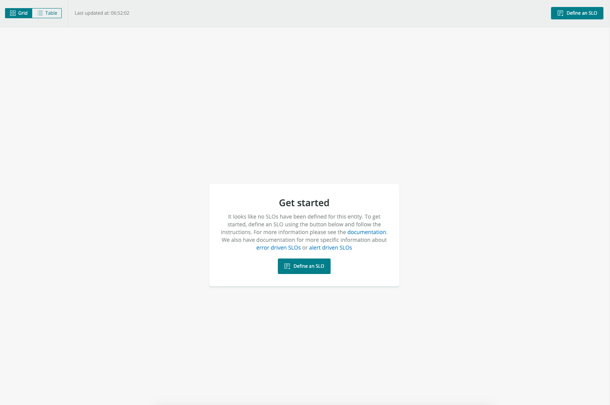
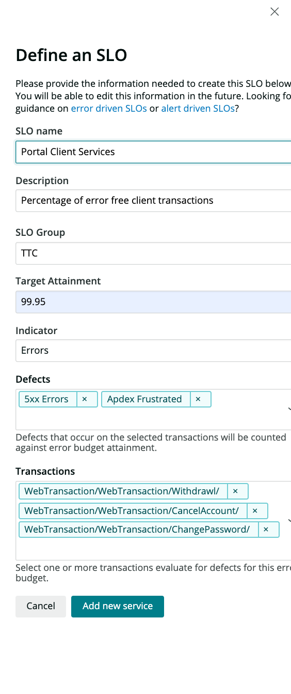
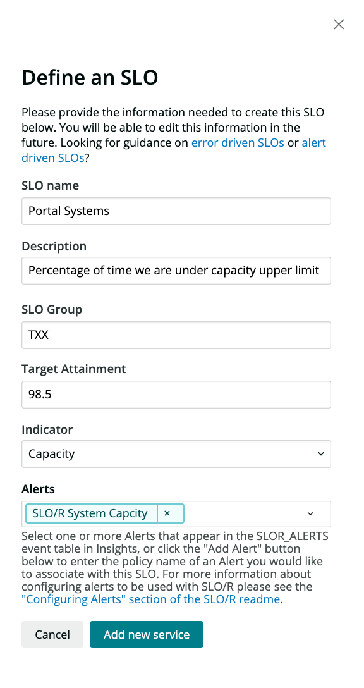
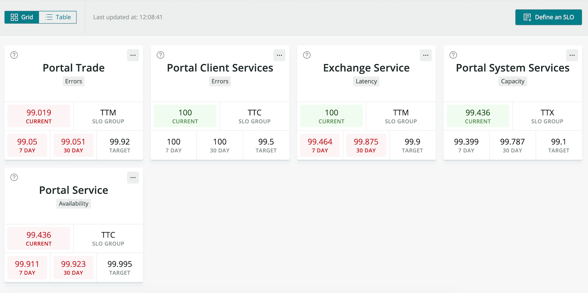
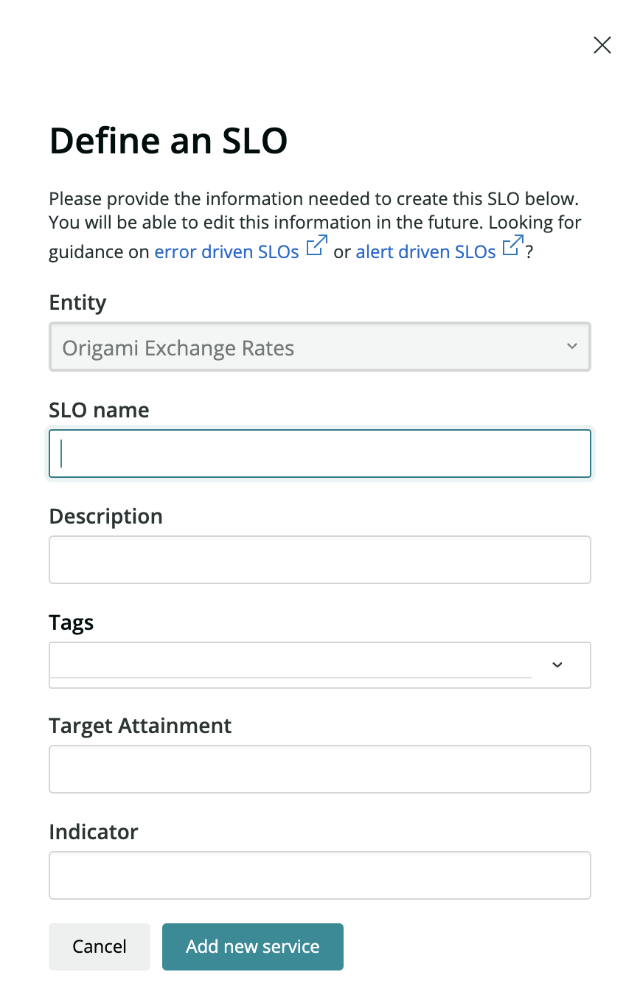
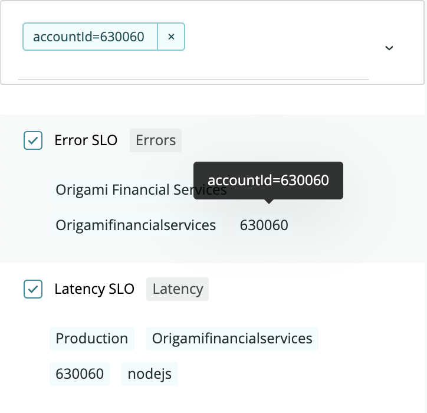

[](https://opensource.newrelic.com/oss-category/#new-relic-one-catalog-project)


# SLO/R

  [](https://snyk.io/test/github/newrelic/nr1-slo-r)


## Announcement

***New Relic Service Level Management is now in Beta!*** To find out more please take a look at the [docs](https://docs.newrelic.com/docs/service-level-management/intro-slm).

Service Level Management introduces the ability to define and analyse Service Levels with a scalable and centralized user experience.

For users of SLO/R you can migrate the existing SLOs you have defined to this new format. Just follow the instructions in our [migration companion](./docs/slor_slm_migration.md). 

> What does this mean for the future of SLO/R?
> - We will be retiring SLO/R from the New Relic Apps Catalog. We highly recommend any new users take advantage of the in-product SLM experience as it is far superior to the SLO/R open source project.
> - We will update this repo to legacy status, and keep the code available as an example of working with SLOs.
> - For active users of SLO/R we will be reaching out to ensure your transition to the in-product experience is as easy as possible.  


## Usage

SLO/R lets you quickly define SLOs for **error**, **availability**, **capacity**, and **latency** conditions.

You can use the application for reporting out your results. By measuring SLO attainment across your service estate, you’ll be able to determine what signals are most important.

Using New Relic as a consistent basis to define and measure your SLOs offers better insight into comparative SLO attainment in your service delivery organization.

SLO/R provides two mechanisms for calculating SLOs: **event based - availability/latency** (calculated by defects or a specified latency on transactions) and **custom (alert) based** which includes **availability**, **capacity**, and **latency** types (calculated by total duration of alert violation).

> We are keen to see SLO/R evolve and grow to include additional features and visualizations. For version 1.0.1, we wanted to ship the core SLO calculation capabilities. We expect to rapidly build upon this core functionality through several releases. Please add an issue to the repo is there's a feature you'd like to see.
> For more details about the SLOs and their calculations, please see [error driven SLOs](./docs/error_slos.md) and [alert driven SLOs](./docs/alert_slos.md).

## Open source license

This project is distributed under the [Apache 2 license](LICENSE).

## Dependencies

Requires [`New Relic APM`](https://newrelic.com/products/application-monitoring).

SLO/R is intended to work specifically with services reporting to New Relic via an APM Agent. The service provides an entity upon which to define SLOs.

- `Event-based SLO’s` work with [APM Transaction data](https://docs.newrelic.com/docs/insights/insights-data-sources/default-data/apm-default-events-insights).
- `Custom (alert-based) SLO’s` require a custom webhook configured to write `SLOR_ALERTS` events to NRDB. See [Configuring SLO/R Alert Webhook](#configuring-slor-alert-webhook) for specific instructions.

## Getting started

1. First, ensure that you have [Git](https://git-scm.com/book/en/v2/Getting-Started-Installing-Git) and [NPM](https://www.npmjs.com/get-npm) installed. If you're unsure whether you have one or both of them installed, run the following command(s) (If you have them installed these commands will return a version number, if not, the commands won't be recognized):

   ```bash
   git --version
   npm -v
   ```

2. Next, install the [New Relic One CLI](https://one.newrelic.com/launcher/developer-center.launcher) by going to [this link](https://one.newrelic.com/launcher/developer-center.launcher) and following the instructions (5 minutes or less) to install and set up your New Relic development environment.
3. Next, to clone this repository and run the code locally against your New Relic data, execute the following command:

   ```bash
   nr1 nerdpack:clone -r https://github.com/newrelic/nr1-slo-r.git
   cd nr1-slo-r
   nr1 nerdpack:serve
   ```

Visit [https://one.newrelic.com/?nerdpacks=local](https://one.newrelic.com/?nerdpacks=local), navigate to the Nerdpack, and :sparkles:

## Deploying this Nerdpack

Open a command prompt in the nerdpack's directory and run the following commands.

```bash
# To create a new uuid for the nerdpack so that you can deploy it to your account:
nr1 nerdpack:uuid -g [--profile=your_profile_name]

# To see a list of APIkeys / profiles available in your development environment:
# nr1 profiles:list
nr1 nerdpack:publish [--profile=your_profile_name]
nr1 nerdpack:deploy [-c [DEV|BETA|STABLE]] [--profile=your_profile_name]
nr1 nerdpack:subscribe [-c [DEV|BETA|STABLE]] [--profile=your_profile_name]
```

Visit [https://one.newrelic.com](https://one.newrelic.com), navigate to the Nerdpack, and :sparkles:

## Configuring SLO/R Alert Webhook

The custom events - availability, capacity, and latency SLO types within SLO/R are calculated using the total duration of alert violations. In order to record those alert violations we need to enable an Insights directed Webhook to capture the `open` and `close` events.

The alert payload needs to be as specified for SLO/R to operate as expected. Please follow [these instructions](./docs/slor_alerts_config.md) to enable the alert event forwarding.

For more information on sending alert data to New Relic, see [Sending Alerts data to New Relic](https://blog.newrelic.com/product-news/sending-alerts-data-to-insights/).

## How to configure and use SLO/R

### Configuration in Entity Explorer

SLO definitions are scoped and stored with service entities. Open a service entity by exploring your services in the [Entity explorer](https://docs.newrelic.com/docs/new-relic-one/use-new-relic-one/ui-data/new-relic-one-entity-explorer-view-performance-across-apps-services-hosts) from the [New Relic One homepage](https://one.newrelic.com).


Select the service you are interested in creating SLOs for. In our example we will be using the Origami Portal Service.


Select the SLO/R New Relic One app from the left-hand navigation in your entity.


If you (or others) haven't configured an SLO the canvas will be empty. Just click on the **Define an SLO** button to begin configuring your first SLO.


The UI will open a side-panel to facilitate configuration. Fill in the fields:

- SLO Name: Give your SLO a name, this has to be unique for the service or will overwrite similarly named SLOs for this entity.
- Description: Give a quick overview of what you're basing this SLO on.
- SLO Group: This is grouping meta-data. Typically organizations are responsible for multiple services and SLOs. This gives us an ability to roll up the SLO to an organizational attainment.
- Target attainment: The numeric value as a percentage, you wish as your SLO target (e.g. 99.995)
- Indicator: There are four indicators for SLOs in SLO/R - **Error**, **Availability**, **Capacity**, and **Latency**. Error SLOs are calculated from _Transaction_ event defects. Availability, latency, and capacity SLOs are calculated by alert violations.

Example error SLO


For **Error** SLOs you need to define the defects you wish to measure and the transaction names you want to associate with this SLO.

Example Availability SLO


Alert driven SLOs depend on alert events being reported in the SLOR_ALERTS table. Please see [SLO/R alerts config](./docs/slor_alerts_config.md) to ensure you're set up to capture alert events.

Once you've created a few SLOs you should see a view like the following:



### Configuration in Launcher app

Other way of configuring SLO is through Launcher app. Difference between creating SLOs from Entity Explorer and from Launcher is that entity must be selected first.



### Using app from Launcher

It is possible to combine multiple SLOs into tables and user selection is stored in NRDB.


SLOs can be filtered by tags attached to them:



### How is SLO/R arriving at the SLO calculations?

For details, see [Alert SLOs](./docs/alert_slos.md) and [Error SLOs](./docs/error_slos.md).

## Community Support

New Relic hosts and moderates an online forum where you can interact with New Relic employees as well as other customers to get help and share best practices. Like all New Relic open source community projects, there's a related topic in the New Relic Explorers Hub. You can find this project's topic/threads here:

[https://discuss.newrelic.com/t/track-your-service-level-objectives-with-the-slo-r-nerdpack/90046](https://discuss.newrelic.com/t/track-your-service-level-objectives-with-the-slo-r-nerdpack/90046)

Please do not report issues with SLO/R to New Relic Global Technical Support. Instead, visit the [`Explorers Hub`](https://discuss.newrelic.com/c/build-on-new-relic) for troubleshooting and best-practices.

## Issues and enhancement requests

Issues and enhancement requests can be submitted in the [Issues tab of this repository](../../issues). Please search for and review the existing open issues before submitting a new issue.

## Security

As noted in our [security policy](https://github.com/newrelic/nr1-slo-r/security/policy), New Relic is committed to the privacy and security of our customers and their data. We believe that providing coordinated disclosure by security researchers and engaging with the security community are important means to achieve our security goals.

If you believe you have found a security vulnerability in this project or any of New Relic's products or websites, we welcome and greatly appreciate you reporting it to New Relic through [HackerOne](https://hackerone.com/newrelic).

## Contributing

Contributions are welcome (and if you submit an enhancement request, expect to be invited to contribute it yourself :grin:). Please review our [contributors guide](CONTRIBUTING.md).

Keep in mind that when you submit your pull request, you'll need to sign the CLA via the click-through using CLA-Assistant. If you'd like to execute our corporate CLA, or if you have any questions, please drop us an email at opensource+nr1-slo-r@newrelic.com.
