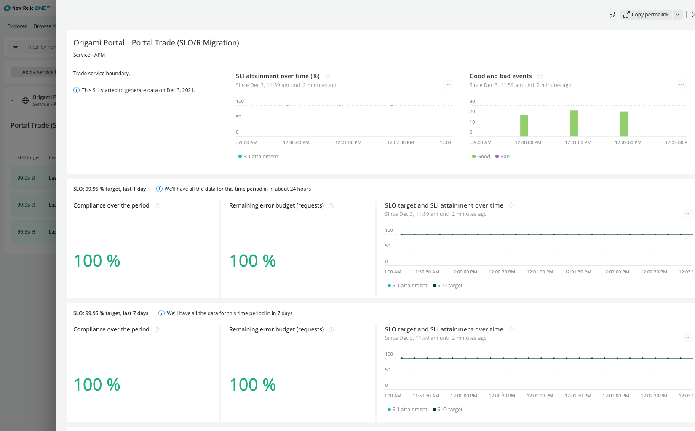

# Migrate SLOs you have defined with SLO/R to the New Relic SLM format
The SLO/R community applications allows user to create Error and Availability driven SLOs. Error SLOs can be converted to the SLM format defined by New Relic product. This guide is intended as an overview of the migration capability. 

Once your SLO has been migrated to SLM it will begin accruing its SLI metric.  

## Reasons to migrate
1. The SLM capability is a fully supported feature of the New Relic user experience. The authors and contributors to the SLO/R project wanted to create a novel approach to SLO definition and measurement, the New Relic product team has validated the approach in SLO/R and implemented a robust enterprise ready SLM capability that will be the basis for future product elaboration.
2. Because SLIs from the new SLM feature are metrics (not just results from NRQL queries), the SLM user interface and individual SLI views are much faster and more robust. You can easily view multiple SLIs with no performance or inspected limit impact.  
3. The SLI metrics can be easily used with New Relic Alerts & AI, a limitation the SLO/R app could not overcome. 

## Migration process

### Step 1: Pick your SLOs to migrate
 In SLO/R you can interact with SLO definitions in 2 locations; the SLO/R main screen launcher, or the APM entity instance left panel navigation. 

SLO/R Launcher View.

SLO/R Entity View.

 With the latest release of SLO/R we have introduced a "Migrate" button that allows you to select the available SLOs from either context (launcher or entity).  

Simply check the SLOs you wish to migrate. When you migrate an SLO from SLO/R we will append an SLI ID to your SLO/R SLO document, this will indicate the SLO has been migrated and will disable the selection of this SLO for migration again.

Select the SLO you want to migrate to activate the migration action.

### Step 2: Click Migrate
With your SLOs selected just click the Migrate button in the SLO/R migration modal. This will convert each of the SLOs into the New Relic SLM format.

Note: SLOs you have previously migrated will be disabled for migration, you will see the "Migration Id" associated with those SLOs. Alert driven SLOs are not eligible for migration (they depend on more complex alert duration calculations that we can't replicate with the SLM metric system). 

### Step 3: View your migrated SLO in New Relic SLM
From the New Relic One menu, select "More" and "Service Levels" to open your account wide service level view. Herein, you will see the SLOs migrated from SLO/R.

The Service Levels you have defined for the associated account will be listed here, be sure your account picker reflects the account where your entities are contained. The SLO/R SLOs you have migrated will appear in this view. The name of the SLM SLI will be the SLO/R SLO name with "(SLO/R Migration)" appended. 

When the SLO has been newly migrated it will start accruing metric data, so will appear empty at first. 

After a few minutes the SLI will be populated with metric data. 

You can drill down to each SLI for a more detailed view of SLI compliance. 

That's all folks! We hope the SLO/R project has been useful, we're looking forward to more to come with New Relic Service Level Management in the coming months.

